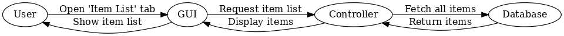
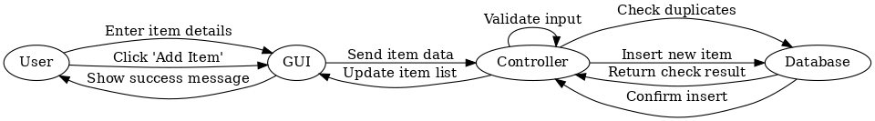
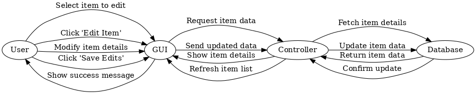
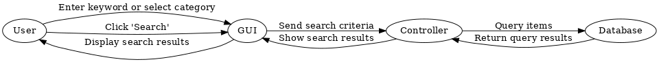
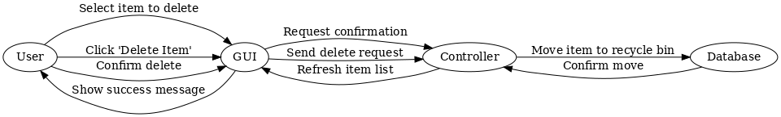
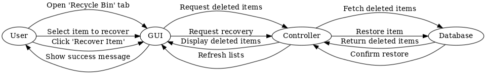
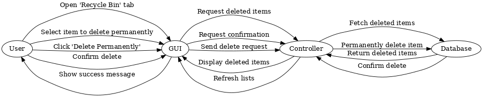
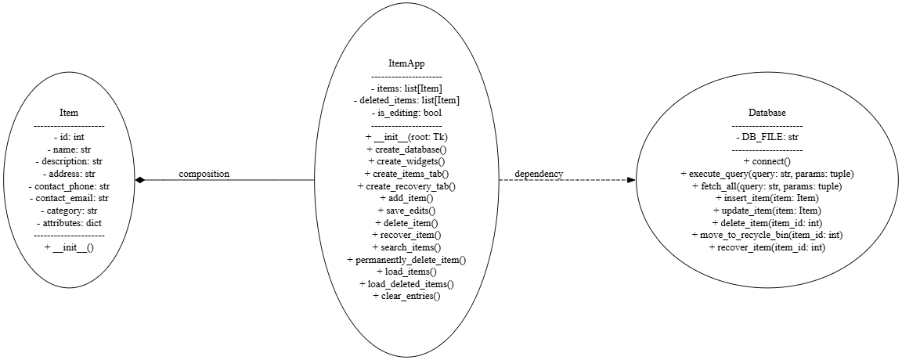

# 物品复活软件（Items-Revival）

## 项目概述
大学生们往往有些物品舍不得丢掉，但不处理又占用太多空间。本软件旨在帮助这些物品找到新的用途，或者帮助拥有者更好地管理这些物品。通过使用物品“复活”软件，用户可以添加、管理和查找物品，记录它们的详细信息，方便日后的利用或者转赠。

物品复活系统（Items-revival)是一个基于 Python 和 Tkinter 开发的桌面应用程序，支持对物品的管理，包括添加、编辑、删除、恢复、以及从回收站永久删除等功能。项目使用 SQLite 数据库来存储物品数据，并提供友好的图形用户界面（GUI）进行交互。

为CS3331软件工程（2024-2025-1）课程的课程项目。

---

## 功能概述

### 1. **物品管理**
- 添加新物品，支持填写以下信息：
  - 名称
  - 类别（食品、书籍、工具）
  - 描述
  - 地址
  - 联系人信息（手机、邮箱）
  - 扩展属性（根据类别动态生成，如食品的保质期、书籍的作者等）
- 搜索物品：
  - 按类别搜索。
  - 支持模糊关键词搜索（名称、描述、联系人信息等）。
- 编辑物品：
  - 支持加载选中物品到编辑框并修改。
  - 避免与现有物品名称和类别重复的冲突。
- 删除物品：
  - 删除后物品会被移动到“回收站”，用户可以选择恢复或永久删除。

### 2. **回收站管理**
- 查看所有被删除的物品。
- 恢复物品：
  - 支持将物品从回收站恢复到主物品列表。
  - 如果存在名称和类别冲突，可选择替换或放弃恢复。
- 永久删除物品：
  - 不可恢复，操作需用户确认。

### 3. **动态扩展属性**
根据物品类别，系统会动态生成扩展属性字段：
- **食品**：
  - 保质期
  - 数量
- **书籍**：
  - 作者
  - 出版社
- **工具**：
  - 品牌
  - 型号

---

## 技术栈

- **语言**：Python
- **界面**：Tkinter
- **数据库**：SQLite3
- **数据格式**：JSON（存储扩展属性）

---

## 用例与顺序图

### **1.参与者**
**用户**：系统的直接使用者，负责物品的添加、编辑、删除、恢复等操作。

### **2.用例列表**
| **用例编号** | **用例名称**        | **描述**            |
|----------|---------------------|-------------------|
| UC01     | 查看物品列表       | 用户可以查看当前所有物品的列表信息 |
| UC02     | 添加物品           | 用户可以向主列表添加新的物品并填写其信息 |
| UC03     | 编辑物品           | 用户可以修改主列表中的物品信息   |
| UC04     | 搜索物品           | 用户可以通过关键词或类别搜索物品  |
| UC05     | 删除物品           | 用户可以将物品移入回收站      |
| UC06     | 恢复物品           | 用户可以查看回收站并将物品恢复到主列表 |
| UC07     | 永久删除物品       | 用户可以查看回收站并永久删除选中的物品 |

### **3.用例说明与顺序图**

### **UC01：查看物品列表**
- **主要参与者**：用户
- **目标**：查看当前所有物品的信息。
- **基本流程**：
  1. 用户启动系统，进入“物品列表”标签页。
  2. 系统从数据库加载所有物品的信息。
  3. 系统将物品信息以表格形式显示在界面中。


### **UC02：添加物品**
- **主要参与者**：用户
- **目标**：将新的物品添加到系统，同时根据物品类别动态更新扩展属性字段。
- **前置条件**：系统已启动，用户位于“物品列表”标签页。
- **基本流程**：
  1. 用户填写物品的基本信息（如名称、描述、类别、联系人等）。
  2. 用户选择物品的类别，系统根据类别动态加载对应的扩展属性字段：
     - **食品**：保质期、数量。
     - **书籍**：作者、出版社。
     - **工具**：品牌、型号。
  3. 用户填写扩展属性字段。
  4. 用户点击“添加物品”按钮。
  5. 系统验证输入信息的合法性（名称与类别必须填写且不能重复）。
  6. 系统将物品信息保存到数据库，并更新物品列表。
  7. 系统显示“物品已添加成功”的提示。


### **UC03：编辑物品**
- **主要参与者**：用户
- **目标**：修改已存在的物品信息，同时根据物品类别动态更新扩展属性字段。
- **前置条件**：用户已选中要编辑的物品。
- **基本流程**：
  1. 用户在物品列表中选中某个物品。
  2. 用户点击“编辑物品”按钮，系统加载物品信息到输入框，并根据物品的类别动态显示对应的扩展属性字段：
     - **食品**：保质期、数量。
     - **书籍**：作者、出版社。
     - **工具**：品牌、型号。
  3. 用户修改基本信息或扩展属性字段。
  4. 用户点击“保存编辑”按钮。
  5. 系统验证输入信息的合法性（名称与类别组合不能重复）。
  6. 系统更新物品信息，并刷新物品列表。
  7. 系统显示“物品已更新成功”的提示。


### **UC04：搜索物品**
- **主要参与者**：用户
- **目标**：根据类别和关键词搜索物品。
- **前置条件**：用户位于“物品列表”标签页。
- **基本流程**：
  1. 用户在搜索框中输入关键词或选择类别。
  2. 用户点击“查找”按钮。
  3. 系统根据输入条件查询数据库。
  4. 系统将匹配的结果显示在物品列表中。
  5. 如果没有匹配结果，系统显示提示信息。


### **UC05：删除物品**
- **主要参与者**：用户
- **目标**：将选中的物品移入回收站。
- **前置条件**：用户已选中要删除的物品。
- **基本流程**：
  1. 用户在物品列表中选中某个物品。
  2. 用户点击“删除物品”按钮。
  3. 系统弹出删除确认框，用户确认操作。
  4. 系统将物品从主列表中移除，添加到回收站。
  5. 系统显示“物品已删除”的提示。


### **UC06：恢复物品**
- **主要参与者**：用户
- **目标**：将回收站中的物品恢复到主列表，同时支持查看回收站中的所有物品。
- **前置条件**：用户已选中要恢复的物品，用户位于“回收站”标签页。
- **基本流程**：
  1. 用户进入“回收站”标签页。
  2. 系统从数据库加载回收站中的物品信息，并以表格形式显示。
  3. 用户在回收站中选中某个物品。
  4. 用户点击“恢复选中物品”按钮。
  5. 系统验证主列表中是否存在同名同类别的物品：
     - 如果存在，提示用户是否覆盖原有物品。
     - 如果不存在，直接恢复物品。
  6. 系统将物品从回收站移回主列表。
  7. 系统显示“物品已恢复”的提示。


### **UC07：永久删除物品**
- **主要参与者**：用户
- **目标**：从回收站中永久删除物品，同时支持查看回收站中的所有物品。
- **前置条件**：用户已选中要永久删除的物品，用户位于“回收站”标签页。
- **基本流程**：
  1. 用户进入“回收站”标签页。
  2. 系统从数据库加载回收站中的物品信息，并以表格形式显示。
  3. 用户在回收站中选中某个物品。
  4. 用户点击“永久删除选中物品”按钮。
  5. 系统弹出永久删除确认框，用户确认操作。
  6. 系统将物品从数据库中彻底移除。
  7. 系统显示“物品已永久删除”的提示。

---

## 类与类图
### **1. 类的定义**

### **`Item` 类**
- **作用**：`Item` 是系统的核心数据模型，用于表示单个物品。
- **属性**：
  - `id`: 每个物品的唯一标识符。
  - `name`: 物品的名称。
  - `description`: 物品的描述信息。
  - `address`: 物品的存放位置或关联地址。
  - `contact_phone`: 物品联系人的手机号码。
  - `contact_email`: 物品联系人的电子邮件地址。
  - `category`: 物品的类别（如“食品”、“书籍”或“工具”）。
  - `attributes`: 扩展属性（根据类别动态变化，如食品的保质期、书籍的作者等）。
- **方法**：
  - `__init__`: 初始化方法，用于创建 `Item` 对象实例。

### **`ItemApp` 类**
- **作用**：`ItemApp` 是系统的核心应用逻辑类，负责管理整个程序的流程，包括用户界面、数据操作和功能调用。
- **属性**：
  - `root`: Tkinter 窗口对象，用于表示 GUI 的根窗口。
  - `items`: 主物品列表，存储当前所有未删除的物品。
  - `deleted_items`: 回收站中的物品列表。
  - `is_editing`: 布尔值，表示当前是否处于编辑模式。
- **方法**：
  - **应用初始化方法**：
    - `__init__`: 初始化整个应用程序，包括创建数据库、加载数据和初始化界面。
  - **数据库操作**：
    - `create_database`: 创建存储物品和回收站的数据库表。
  - **界面创建方法**：
    - `create_widgets`: 创建界面组件（如标签页、表格、输入框）。
    - `create_items_tab`: 创建物品管理的标签页。
    - `create_recovery_tab`: 创建回收站的标签页。
  - **核心功能方法**：
    - `add_item`: 添加新的物品到主列表。
    - `save_edits`: 保存对物品的编辑。
    - `delete_item`: 删除物品，将其移动到回收站。
    - `recover_item`: 从回收站恢复物品。
    - `permanently_delete_item`: 从回收站永久删除物品。
    - `search_items`: 搜索物品。
  - **数据管理方法**：
    - `load_items`: 从数据库加载主物品列表。
    - `load_deleted_items`: 从数据库加载回收站物品。
    - `clear_entries`: 清空输入框和界面。

### **`Database` 类**
- **作用**：`Database` 负责与 SQLite 数据库交互，提供所有数据的增删改查功能。
- **属性**：
  - `DB_FILE`: 数据库文件路径。
- **方法**：
  - **核心功能**：
    - `connect`: 连接到 SQLite 数据库。
    - `execute_query`: 执行数据库查询（用于更新或插入数据）。
    - `fetch_all`: 执行查询并获取所有返回的结果。
    - `insert_item`: 插入新的物品数据。
    - `update_item`: 更新物品数据。
    - `delete_item`: 从数据库中删除物品。
    - `move_to_recycle_bin`: 将物品从主列表移动到回收站。
    - `recover_item`: 从回收站恢复物品到主列表。

### **2.2 类图**

`ItemApp`与`Item`间是**组合（Composition)关系**。
- `ItemApp`完全控制着`Item`的生命周期，当`ItemApp`被销毁时，`Item`也随之销毁。

`ItemApp`与`Database`间是**依赖（Dependency）关系**。
- `ItemApp`在需要与数据库交互时使用`Database` ，并不直接持有`Database`的实例，也不控制其生命周期。


---

## 安装和运行

### 1. 安装依赖
确保已安装 Python 3.x和必要的依赖库。


### 2. 克隆项目
将项目克隆到本地：
```bash
git clone https://github.com/lym130/items-revival-app.git
cd item-revival-system
```

### 3. 运行项目
执行以下命令启动程序：
```bash
python items-revival.py
```

---

## 数据库结构

- **`items` 表**：存储主物品列表。
  - `id`：主键，自增。
  - `name`：物品名称。
  - `description`：物品描述。
  - `address`：地址。
  - `contact_phone`：联系人手机。
  - `contact_email`：联系人邮箱。
  - `category`：物品类别。
  - `attributes`：扩展属性（JSON 格式）。

- **`deleted_items` 表**：存储已删除物品。
  - 表结构与 `items` 表相同。

---

## 使用说明

### 添加物品
1. 填写物品信息，包括名称、类别、描述等字段。
2. 根据类别填写扩展属性字段。
3. 点击 **“添加物品”** 按钮保存。

### 搜索物品
1. 在搜索框中输入关键词或选择类别。
2. 点击 **“查找”** 按钮查看匹配结果。

### 编辑物品
1. 在物品列表中选择一项。
2. 点击 **“编辑物品”** 按钮，数据会加载到输入框中。
3. 修改后点击 **“保存编辑”**。

### 删除物品
1. 在物品列表中选择一项或多项。
2. 点击 **“删除物品”** 按钮，物品会移动到回收站。

### 恢复物品
1. 切换到 **“回收站”** 标签页。
2. 选择一项或多项物品。
3. 点击 **“恢复选中物品”** 按钮。

### 永久删除物品
1. 切换到 **“回收站”** 标签页。
2. 选择一项或多项物品。
3. 点击 **“永久删除选中物品”** 按钮。

---

## 注意事项

1. **防止数据重复**：
   - 系统会检查名称和类别的组合是否重复，避免重复添加。
2. **数据不可逆操作**：
   - 永久删除的物品无法恢复，请谨慎操作。
3. **扩展属性限制**：
   - 只有当选择具体类别时，才会显示对应的扩展属性输入框。

---

## 项目结构

```plaintext
item-revival-system/
├── items-revival.py    # 主程序文件
├── items_with_categories.db  # SQLite 数据库文件
├── README.md    # 项目说明文档（含用例模型、顺序图、类图）
├── UC0X_Sequence_Diagram    # 各用例顺序图
├── Class_diagram.png    # 程序类图
```

## 贡献指南
欢迎任何形式的贡献！如果您有建议或发现了bug，可以通过提交issue的方式向我们反馈，或者fork项目并发起Pull Request。

## 许可证
本项目使用 [MIT License](LICENSE) 进行许可。

## 联系方式
如果有任何问题或建议，请联系 [lym003x@sjtu.edu.com]。
